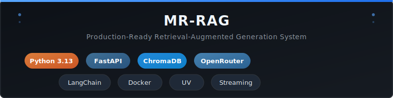

<p align="center">
  
</p>

# Features Overview

## click for [QUICK START](./USAGE.md)
## click for [Read Features](./FEATURES.md)

## 1. Core RAG Pipeline

**Retrieval-Augmented Generation** for intelligent question-answering over scraped data.

### Ingestion
```
File (JSON/MD/TXT) → Load → Chunk → Embed → Store in ChromaDB
```
- Loads JSON, Markdown, and Plain Text files via `AutoDocumentLoader`
- Splits text using LangChain's RecursiveCharacterTextSplitter
- Generates embeddings via OpenRouter API
- Stores vectors in ChromaDB (Docker)

### Question Answering
```
Question → Embed → Search ChromaDB → Build Context → LLM → Answer
```
- Embeds user questions
- Retrieves top-K semantically similar chunks from ChromaDB
- Filters low-relevance chunks (score < 0.15)
- Builds context from filtered chunks
- Generates answer via OpenRouter LLM
- Returns answer with source citations and relevance scores

---

## 2. Multi-Layer Caching

Three independent cache tiers with different TTLs and backends.

| Layer | TTL | Cache Key | What It Caches |
|-------|-----|-----------|----------------|
| Embedding | 1 hour | Query text hash | Query → embedding vector |
| LLM | 24 hours | Serialized messages | Messages → LLM response |
| RAG Q&A | 24 hours | Question text + semantic similarity | Question → full answer |

### RAG Cache: Two Sub-Layers

```
Question
  → [Exact Match] identical text? → HIT → instant response
  → MISS:
    → Embedding API
    → [Semantic Match] similar question? (cosine ≥ 0.92) → HIT → ~1s response
    → MISS:
      → ChromaDB + LLM → cache result
```

**Cache Backends:**
- InMemoryCache — wraps LangChain's `InMemoryCache` (ephemeral, default)
- SQLiteCache — persistent across restarts with TTL

---

## 3. Streaming API

Server-Sent Events (SSE) for real-time token delivery.

```
POST /chat/stream
```
- First token appears in ~3-5 seconds
- Progressive display while LLM generates
- Cache works with streaming (cache hits return instantly)
- Uses `httpx.AsyncClient.stream()` to stream from OpenRouter SSE

---

## 4. Token Reduction

Optimizations to reduce LLM token consumption by ~70%.

| Setting | Before | After | Impact |
|---------|--------|-------|--------|
| `chunk_size` | 1024 | **512** | Smaller chunks = less text per chunk |
| `top_k` | 5 | **3** | Fewer chunks sent to LLM |
| `retrieval_min_score` | — | **0.15** | Filters irrelevant chunks |
| `chunk_overlap` | 200 | **100** | Reduced redundancy |

All settings are configurable via `.env` file.

---

## 5. Multi-Format Document Loading

`AutoDocumentLoader` dispatches to the appropriate loader based on file extension.

| Format | Extension | Loader | Description |
|--------|-----------|--------|-------------|
| JSON | `.json` | LangChain JSONLoader | Objects with `content` or `text` field + metadata |
| Markdown | `.md` | MarkdownHeaderTextSplitter | Splits by headings (#, ##, ###, etc.) |
| Plain Text | `.txt` | LangChain TextLoader | Entire file as one document |

Easy to extend — add a new loader by implementing `DocumentLoaderPort`.

---

## 6. UUID-Based Chunk IDs

Each chunk receives a unique ID: `chunk_{uuid4_hex[:12]}_{index}`

- Eliminates collision risk on re-ingestion
- Prevents duplicate chunks in ChromaDB
- No need for manual ID management

---

## 7. Scheduler Cron Job

Automated data ingestion from an external Scraper API.

### Flow
```
Scheduler (every N minutes)
  → POST /api/v1/token/ → JWT token
  → GET /api/v1/messages/search/?page=1..N → all messages
  → Save to temp JSON file
  → Run IngestionPipeline (load → chunk → embed → store)
  → Log: timestamp, total documents, status
  → Delete temp file
```

### Features
- Configurable interval (default: 60 minutes)
- JWT authentication with auto-refresh
- Pagination support (automatic page 1..N)
- **Exponential backoff retry** on API failure (60s, 120s, 240s, ... up to 5 attempts)
- Temp file lifecycle: auto-created → auto-deleted after success
- Last-fetch log: `data/scheduler_log.json`

---

## 8. Cascading Retrieval (Synonym Support)

Three-stage cascade to handle questions with synonyms, alternative phrasings, or out-of-context queries.

### Flow
```
Stage 1 — Normal Search (always runs)
  → embed query → search ChromaDB → filter by min_score
  → If results are high-relevance → use strict prompt → done
  → If results are empty or low-relevance (avg score < 0.30):
     │
     └─→ Stage 2 — Query Expansion (if enabled)
           → LLM generates N alternative phrasings with synonyms
           → Embed each variant → search → deduplicate → merge
           │
           └─→ Stage 3 — Loose Prompt (if enabled)
                 → Context exists: SYSTEM_PROMPT_LOOSE (supplement with own knowledge)
                 → No context: SYSTEM_PROMPT_GENERAL (answer from general knowledge)
```

All flags default to `false` — pipeline behaves identically to the original unless you opt in.

---

## 9. Architecture: Hexagonal (Ports & Adapters)

Clean separation between domain, application, infrastructure, and scheduler layers.

**6 Abstract Ports:**
- `EmbeddingPort` — generate embeddings
- `LLMPort` — generate text (standard + streaming)
- `VectorStorePort` — store/search vectors
- `DocumentLoaderPort` — load documents from sources
- `TextSplitterPort` — split documents into chunks
- `CachePort` — cache responses (with semantic lookup)

**Benefits:**
- Swap any component without changing other code
- Easy to test (mock ports)
- New providers implement existing interfaces